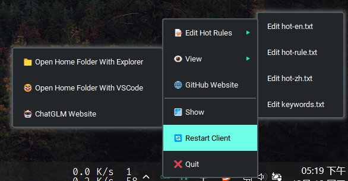

# 😘 CapsWriter-Offline 图形界面包分支 （ 仅  <span style="color: #4ABAFF;">[Windows 10+](https://www.microsoft.com/zh-cn/windows) </span> ）


#  <span style="color: #4ABAFF;">[Windows](https://www.microsoft.com/zh-cn/windows)</span> 端离线语音输入、中译英、字幕转录；在线多译多、云剪贴板；离、在线翻译并替换；简繁体转换

## 😎 八个功能：

1. 按下键盘上的大写锁定键 `CapsLock` ，录音开始，当松开大写锁定键时，就会识别你的录音，并将识别结果立刻输入
2. 按下键盘上的 `Left Shift` 再按 `CapsLock` 可以将识别结果离线翻译为英文，并将识别结果立刻输入
3. 按下键盘上的 `Right Shift` 再按 `CapsLock` 可以将识别结果[在线翻译](https://github.com/OwO-Network/DeepLX)为多国语言，默认设置翻译为日文，并将识别结果立刻输入
4. 将音视频文件拖动到客户端 `start_client_gui.exe` 打开，即可转录生成 srt 字幕
5. 按下客户端主界面的 `云贴` 按钮，即可将客户端文本框中的前 1024 个字节发布到[云剪贴板](https://cv.j20.cc/) ，并生成获取链接和二维码
6. 按下键盘上的 `Ctrl` + `Alt` + `P` ，可以将光标选中的 `中文` [离线翻译](https://huggingface.co/Helsinki-NLP/opus-mt-zh-en)为 `英文` ，并自动覆盖替换原文
7. 按下键盘上的 `Ctrl` + `Alt` + `[` ，可以将光标选中的 `任意语言` [在线翻译](https://github.com/OwO-Network/DeepLX)为 `在线翻译目标语言` ，并自动覆盖替换原文
8. 按下键盘上的 `Ctrl` + `Alt` + `F` ，可以使用 everything 搜索光标选中的文字
9. 快速双击 `CapsLock` ，可语音输入繁体。长按 `CapsLock` 实现按键原有功能切换大写锁定。

# 📙 目录

- [✨ 特性](#-特性)
- [⬇️ 下载地址](#-下载地址)
- [❗ 注意事项](#-注意事项)
- [🤓 源码运行](#-源码运行)
- [🔧 修改配置](#-修改配置)
- [🪳 提交 Bug ](https://github.com/H1DDENADM1N/CapsWriter-Offline/issues)

# 👀 最新更新

## 双击`录音键`临时转换 `简/繁` 体中文输出，可在 `config.py` 设置 `简/繁` 中文作为主要输出 (@JoanthanWu)

## 更美观的“语音输入中”提示，可在 `hint_while_recording.ini` 设置文本内容、颜色、排除列表等 (@JoanthanWu)
> 
> 

## 更新语音识别模型

- https://k2-fsa.github.io/sherpa/onnx/sense-voice/pretrained.html#sherpa-onnx-sense-voice-zh-en-ja-ko-yue-2024-07-17


## 按下键盘上的 `Ctrl` + `Alt` + `P` ，可以将光标选中的 `中文` 离线翻译为 `英文` ，并自动覆盖替换原文

## 按下键盘上的 `Ctrl` + `Alt` + `[` ，可以将光标选中的 `任意语言` 在线翻译为 `在线翻译目标语言` （ `config.py` `online_translate_target_languages` ），并自动覆盖替换原文

> 

## 按下键盘上的 `Ctrl` + `Alt` + `F` ，可以使用 everything 搜索光标选中的文字

> 

## 跟随鼠标光标位置的新版输入状态提示功能可在 `config.py` 设置禁用

> 

## 新版客户端界面：

> - 透明；极简
> - `Ctrl+鼠标滚轮` 可调整字体大小
> - 标题栏和操作栏失去光标焦点时自动隐藏
> - 窗口贴边自动隐藏
> - 无任务栏图标
>
> 
>
> > 标题栏
> >
> > - 📌：置顶窗口，将它显示在其他窗口之上 / 不置顶
> > - 云贴：按下客户端主界面的 `云贴` 按钮，即可将客户端文本框中的前 1024 个字节发布到[云剪贴板](https://cv.j20.cc/)（一个无依赖即用即走的剪切板） ，并生成获取链接和二维码。实测 5~1024 字节，不足字节补.超出字节无效。
> >   
> > - 清空：清空文本框中的全部内容
>
> > 操作栏
> >
> > - 监听：监听客户端输出 / 不监听，仅用作笔记本
> > - 字符数、字节数统计：光标已选中字符数 / 总字符数 | 字节数

## 新版客户端托盘图标右键菜单：

> 

---

# ✨ 特性

1. 基于 [PySide6](https://pypi.org/project/PySide6/) 的 GUI，服务端 `start_server_gui.exe` 默认使用 [Qt-Material](https://github.com/UN-GCPDS/qt-material) dark_yellow 主题，客户端 `start_client_gui.exe` 默认使用 [Qt-Material](https://github.com/UN-GCPDS/qt-material) dark_teal 主题；基于 [PyStand](https://github.com/skywind3000/PyStand) 绿化便携 `exe`
2. 完全离线、无限时长、低延迟、高准确率、中英混输、中译英、自动阿拉伯数字、自动调整中英间隔
3. 防干扰功能：默认录音时静音并暂停其他音频播放，避免音乐干扰语音输入，通过 `config.py` 中 `mute_other_audio` 和 `pause_other_audio` 配置
4. 离线翻译功能：离线翻译模型[Helsinki-NLP/opus-mt-zh-en](https://huggingface.co/Helsinki-NLP/opus-mt-zh-en) ，组合键 按住 `Left Shift` 再按 `CapsLock` 进行翻译，方便同时需要输入中文和英文翻译的场景。通过 `config.py` 中 `offline_translate_shortcut` 配置
5. 在线翻译功能：基于 [DeepLX](https://github.com/OwO-Network/DeepLX) 可以将识别结果在线翻译为多国语言，默认翻译为日文。过于频繁的请求可能导致 IP 被封。组合键 按住 `Right Shift` 再按 `CapsLock` 进行翻译，方便同时需要输入中文和英文翻译的场景。通过 `config.py` 中 `online_translate_shortcut` 和 `trans_online_target_languages` 配置
6. 转录功能：将音视频文件拖动到客户端 `start_client_gui.exe` 打开，即可转录生成 srt 字幕
7. 热词功能：可以在 `hot-en.txt hot-zh.txt hot-rule.txt` 中添加三种热词，客户端动态载入
8. 日记功能：默认每次录音识别后，识别结果记录在 `年份/月份/日期.md` ，录音文件保存在 `年份/月份/assets`
9. 关键词日记：识别结果若以关键词开头，会被记录在 `年份/月份/关键词-日期.md`，关键词在 `keywords.txt` 中定义
10. 服务端、客户端分离，可以服务多台客户端
11. 编辑 `config.py` ，可以配置服务端地址、快捷键、录音开关……
12. 支持最小化到系统托盘
13. 已包含所有 Python 环境和 models 模型，解压即用
14. 输入状态提示功能：按下 `Capslock` 键会在光标处提示 [✦ 语音输入中‧‧‧](https://github.com/HaujetZhao/CapsWriter-Offline/issues/52#issuecomment-1905758203)；按下 `Shift` 和 `Capslock` 键会在光标处提示 [✦VoiceTrans‧‧‧](https://github.com/HaujetZhao/CapsWriter-Offline/issues/52#issuecomment-1905758203)。注意此功能由 [AutoHotKeyV2](https://www.autohotkey.com/download/) `hint_while_recording.exe` 实现，修改 `config.py` 默认快捷键并**不会**改变提示的按键设置，需要编辑 `hint_while_recording.ahk` 并自行编译替换 `hint_while_recording.exe`
15. 输入状态提示功能 V2：按下 `Capslock` 键会在跟随鼠标指针处提示一个小麦克风图标。默认启用，通过 `config.py` 中 `hint_while_recording_at_cursor_position` 配置
16. 阿拉伯数字化年份功能：默认将\***\*年 大写汉字替换为阿拉伯数字\*\***年，例如一八四八年 替换为 1848 年。通过 `config.py` 中 `Arabic_year` 配置
17. 启动后自动缩小至托盘功能：默认 服务端 `start_server_gui.exe` 启动后不显示主窗口，自动缩小至托盘；客户端 `start_client_gui.exe` 显示主窗口。通过 `config.py` 中 `shrink_automatically_to_tray` 配置
18. 禁止多开功能：默认禁止多开，通过 `config.py` 中 `only_run_once` 配置
19. 一键启动功能：默认服务端 `start_server_gui.exe` 启动后，自动 **🛡️ 以管理员权限** 启动客户端 `start_client_gui_admin.exe`，通过 `config.py` 中 `in_the_meantime_start_the_client_and_run_as_admin` 和 `In_the_meantime_start_the_client_as_admin` 配置
20. 将文本上传至云剪切板，方便向 ios 设备分享。基于 [cv.j20.cc]() ，一个无依赖即用即走的剪切板。实测 5~1024 字节，不足字节补 `.` ，超出字节 `无效` 。
21. 将光标选中了中文离线翻译功能：按下 `Ctrl` + `Alt` + `P` ，可以将光标选中了中文离线翻译为英文，并自动覆盖替换原文。通过 `config.py` 中 `offline_translate_and_replace_the_selected_text_shortcut` 配置
22. 按下键盘上的 `Ctrl` + `Alt` + `[` ，可以将光标选中的 `任意语言` 在线翻译为 `在线翻译目标语言` ，并自动覆盖替换原文。通过 `config.py` 中 `online_translate_and_replace_the_selected_text_shortcut` 和 `online_translate_target_languages` 配置
23. 默认启用双击`录音键`临时转换 `简/繁` 体中文输出的功能，通过 `config.py` 中 `enable_double_click_opposite_state` 配置
24. 默认使用简体中文作为主要输出，快速双击输出繁体中文。设置 `config.py` 中 `convert_to_traditional_chinese_main = '繁'` 可以默认使用繁体中文，双击输出简体中文

# 🪳 无力解决的 Bug

1. 在多屏幕状态，贴边隐藏位置错乱
2. 在多屏幕状态，跟随鼠标光标位置的新版输入状态位置错乱。

# ⬇️ 下载地址

- 123 盘：https://www.123pan.com/s/qBxUVv-H4Zq3.html 提取码:h8vb
- GitHub Release: [Releases · H1DDENADM1N/CapsWriter-Offline](https://github.com/H1DDENADM1N/CapsWriter-Offline/releases)


# ❗ 注意事项

1. 存在杀毒误报，建议关闭杀毒软件和防火墙，再解压
2. 建议先不要修改默认配置，测试能否正常运行
3. 音视频文件转录功能依赖于 `FFmpeg`，打包版本已内置 `FFmpeg`
4. 默认的快捷键是 `caps lock`，你可以打开 `core_client.py` 进行修改
5. 输入状态提示功能由 [AutoHotKeyV2](https://www.autohotkey.com/download/) `hint_while_recording.exe` 实现，修改 `config.py` 默认快捷键并**不会**改变提示的按键设置，需要编辑 `hint_while_recording.ahk` 并自行编译替换 `hint_while_recording.exe`
6. 在线翻译基于 [DeepLX](https://github.com/OwO-Network/DeepLX) ，过于频繁的请求可能导致 IP 被封，如果出现 429 错误，则表示你的 IP 被 DeepL 暂时屏蔽了，请不要在短时间内频繁请求
7. 当某程序以管理员权限运行，可能会出现有识别结果但是却无法在那个程序输入文字的状况，例如：`Listary` 、`PixPin` 等。这是因为 `start_client_gui.exe` 默认以用户权限运行客户端，运行在用户权限的程序无法控制管理员权限的程序。你可以关闭用户权限运行的客户端，尝试使用 `start_client_gui_admin.exe` 以管理员权限运行客户端
8. 添加开机自启动的方法：

   8.1 如果你未更改默认配置（ `In_the_meantime_start_the_client = True` 表示一键启动功能 生效，服务端会自动启动客户端），只用新建 `start_server_gui.exe` 的快捷方式，将服务端的快捷方式放到 `shell:startup` 目录下即可在开机时自动启动服务端和客户端。服务端会自动启动客户端。不要添加客户端的快捷方式。

   8.1.1 如果你未更改默认配置（ `In_the_meantime_start_the_client_as_admin = True` ），启动服务端会自动以管理员权限启动客户端。

   8.1.2 如果你更改了默认配置（ `In_the_meantime_start_the_client_as_admin = False` ），启动服务端会自动以用户权限启动客户端。

   8.2 如果你更改了默认配置（ `In_the_meantime_start_the_client = False` 表示一键启动功能 禁用，启动服务端不会启动客户端），新建 `start_server_gui.exe` 的快捷方式，将服务端的快捷方式放到 `shell:startup` 目录下只会在开机时自动启动服务端。客户端不会被启动。

   8.3 如果你更改了默认配置（ `In_the_meantime_start_the_client = False` ），新建 `start_client_gui.exe` 的快捷方式，将客户端的快捷方式放到 `shell:startup` 目录下只会在开机时自动启动客户端。服务端不会被启动。不要再添加客户端 `start_client_gui_admin.exe` 的快捷方式。

   8.4 如果你更改了默认配置（ `In_the_meantime_start_the_client = False` ），新建 `start_client_gui_admin.exe` 的快捷方式，将客户端的快捷方式放到 `shell:startup` 目录下只会在开机时自动以管理员权限启动客户端。服务端不会被启动。不要再添加客户端 `start_client_gui.exe` 的快捷方式。

9. `🤓 Open Home Folder With VSCode ` 使用前需在 `config.py` 配置 `vscode_exe_path`
10. 输入状态指示位置错乱如何解决？
    10.1 通过 `config.py` 中 `hint_while_recording_at_cursor_position` 配置禁用跟随鼠标光标位置的麦克风形状的输入状态提示；

    10.2 通过重命名或删除 `hint_while_recording.exe` 完全不启用输入光标位置的“✦语音输入中‧‧‧”文字状态提示

    10.3 通过 `hint_while_recording.ini` 中 `hintAtCursorPositionList` 配置将部分程序的输入光标位置的“✦语音输入中‧‧‧”文字状态提示显示到鼠标光标位置

    10.4 通过 `hint_while_recording.ini` 中 `doNotShowHintList` 配置禁用部分程序的输入光标位置的“✦语音输入中‧‧‧”文字状态提示

    10.5 欢迎将位置错乱的exe程序名反馈给我

# 🤓 源码运行

1. 运行 `.\runtime\python.exe .\core_server.py` 脚本 在终端启动服务端，会载入 Paraformer 模型识别模型和标点模型（这会占用 2GB 的内存，载入时长约 50 秒）
2. 运行 `.\runtime\python.exe .\core_client.py` 脚本 在终端启动客户端，会载入中译英模型，打开系统默认麦克风，开始监听按键（这会占用 400MB 的内存，载入时长约 20 秒）
3. 按住 `CapsLock` 键，录音开始，松开 `CapsLock` 键，录音结束，识别结果立马被输入（录音时长短于 0.3 秒不算）
4. 按住 `Left Shift` 再按 `CapsLock` 进行离线翻译，方便同时需要输入中文和英文翻译的场景
5. 按住 `Right Shift` 再按 `CapsLock` 进行在线翻译，方便同时需要输入中文和英文翻译的场景

---

# 🔧 修改配置

你可以编辑 `config.py` ，在开头部分有注释，指导你修改服务端、客户端的：

- 连接的地址和端口，默认是 `127.0.0.1` 和 `6006`
- 键盘快捷键
- 是否要保存录音文件
- 要移除识别结果末尾的哪些标点，（如果你想把句尾的问号也删除掉，可以在这边加上）
- 是否在录音时静音或暂停其他音频播放
- 是否阿拉伯数字化年份
- 是否启动后自动缩小至托盘，不显示主窗口
- 是否禁止多开
- 是否启动服务端时自动启动客户端
- 在线翻译目标语言 参考 [docs-api](https://www.deepl.com/docs-api/translate-text)
- 离、在线翻译并替换 快捷键

  - AR - 阿拉伯语
  - BG - 保加利亚语
  - CS - 捷克语
  - DA - 丹麦语
  - DE - 德语
  - EL - 希腊语
  - EN - 英语（为了向后兼容而未指定的变体；请改为选择 EN-GB 或 EN-US）
  - EN-GB - 英语（英国）
  - EN-US - 英语（美国）
  - ES - 西班牙语
  - ET - 爱沙尼亚语
  - FI - 芬兰语
  - FR - 法语
  - HU - 匈牙利语
  - ID - 印度尼西亚语
  - IT - 意大利语
  - JA - 日语
  - KO - 韩语
  - LT - 立陶宛语
  - LV - 拉脱维亚语
  - NB - 挪威语（博克马尔）
  - NL - 荷兰语
  - PL - 波兰语
  - PT - 葡萄牙语（为了向后兼容而未指定的变体；请改为选择 PT-BR 或 PT-PT）
  - PT-BR - 葡萄牙语（巴西）
  - PT-PT - 葡萄牙语（除巴西葡萄牙语外的所有葡萄牙语变体）
  - RO - 罗马尼亚语
  - RU - 俄语
  - SK - 斯洛伐克语
  - SL - 斯洛文尼亚语
  - SV - 瑞典语
  - TR - 土耳其语
  - UK - 乌克兰语
  - ZH - 中文（简体）

- 是否只在按下录音快捷键时启用麦克风
- 设置 VSCode 可执行文件位置


# 🔧 功能：热词

如果你有专用名词需要替换，可以加入热词文件。规则文件中以 `#` 开头的行以及空行会被忽略，可以用作注释。

- 中文热词请写到 `hot-zh.txt` 文件，每行一个，替换依据为拼音，实测每 1 万条热词约引入 3ms 延迟
- 英文热词请写到 `hot-en.txt` 文件，每行一个，替换依据为字母拼写
- 自定义规则热词请写到 `hot-rule.txt` 文件，每行一个，将搜索和替换词以等号隔开，如 `毫安时  =  mAh`

你可以在 `core_client.py` 文件中配置是否匹配中文多音字，是否严格匹配拼音声调。

检测到修改后，客户端会动态载入热词，效果示例：

1. 例如 `hot-zh.txt` 有热词「我家鸽鸽」，则所有识别结果中的「我家哥哥」都会被替换成「我家鸽鸽」
2. 例如 `hot-en.txt` 有热词「ChatGPT」，则所有识别结果中的「chat gpt」都会被替换成「ChatGPT」
3. 例如 `hot-rule.txt` 有热词「毫安时 = mAh」，则所有识别结果中的「毫安时」都会被替换成「mAh」


# 🔧 功能：日记、关键词

默认每次语音识别结束后，会以年、月为分类，保存录音文件和识别结果：

- 录音文件存放在「年/月/assets」文件夹下
- 识别结果存放在「年/月/日.md」Markdown 文件中

例如今天是 2023 年 6 月 5 号，示例：

1. 语音输入任一句话后，录音就会被保存到 `2023/06/assets` 路径下，以时间和识别结果命名，并将识别结果保存到 `2023/06/05.md` 文件中，方便我日后查阅
2. 例如我在 `keywords.txt` 中定义了关键词「健康」，用于随时记录自己的身体状况，吃完饭后我可以按住 `CapsLock` 说「健康今天中午吃了大米炒饭」，由于识别结果以「健康」关键词开头，这条识别记录就会被保存到 `2023/06/05-健康.md` 中
3. 例如我在 `keywords.txt` 中定义了关键词「重要」，用于随时记录突然的灵感，有想法时我就可以按住 `CapsLock` 说「重要，xx 问题可以用 xxxx 方法解决」，由于识别结果以「重要」关键词开头，这条识别记录就会被保存到 `2023/06/05-重要.md` 中


# 🔧 功能：转录文件

在服务端运行后，将音视频文件拖动到客户端打开，即可转录生成四个同名文件：

- `json` 文件，包含了字级时间戳
- `txt` 文件，包含了分行结果
- `merge.txt` 文件，包含了带标点的整段结果
- `srt` 文件，字幕文件

如果生成的字幕有微小错误，可以在分行的 `txt` 文件中修改，然后将 `txt` 文件拖动到客户端打开，客户端检测到输入的是 `txt` 文件，就会查到同名的 `json` 文件，结合 `json` 文件中的字级时间戳和 `txt` 文件中修正结果，更新 `srt` 字幕文件。

---

# ⬇️ 模型下载链接

服务端使用了 [sensevoice模型](https://k2-fsa.github.io/sherpa/onnx/sense-voice/pretrained.html#sherpa-onnx-sense-voice-zh-en-ja-ko-yue-2024-07-17)

客户端使用了中译英模型 [Helsinki-NLP/opus-mt-zh-en](https://huggingface.co/Helsinki-NLP/opus-mt-zh-en)

- [opus-2020-07-17.zip](https://object.pouta.csc.fi/Tatoeba-MT-models/zho-eng/opus-2020-07-17.zip)


# 🤩 都看到这儿了，给个星星好不好？ ⭐

<details>
<summary><h1">了解更多</h1></summary>

# 🪙 打赏

## 🪙 打赏原版 [CapsWriter-Offline](https://github.com/HaujetZhao/CapsWriter-Offline)

如果你愿意，可以打赏的方式支持原版[CapsWriter-Offline](https://github.com/HaujetZhao/CapsWriter-Offline)作者一下：

> 

## 🪙 打赏图形界面版 [CapsWriter-Offline](https://github.com/H1DDENADM1N/CapsWriter-Offline)

## 感谢你的好意 💖，不过，暂时不必。点个Star⭐，提点🪳Issues，让我知道有人在用，这比金钱更能使我高兴。

---

## [Pywin32](https://github.com/mhammond/pywin32) 打包进 Embedded Python 的方法

本机 Python3.11.8 执行

```
pip install  --target .\site-packages pywin32
```

编辑 `.\runtime\python311._pth` 增加

```
../site-packages/win32
../site-packages/win32/lib
../site-packages/win32ctypes/pywin32
../site-packages/win32ctypes
```

复制 `.\site-packages\pywin32_system32\` 中的 `*.dll` 到 `.\runtime\`

</details>